## 基本信息

| 项目 | 内容 |
| --- | --- |
| 项目名称 | 校园宿舍报修与工单管理系统 |
| 学　　院 | 创业学院 |
| 小组序号 | 02 |
| 成员姓名 | 邓杰 / 尹添一 / 陈梓轩 / 胡宇翔 |
| 指导老师 | 尹兆远 |
| 当前版本 | 软件说明书 v1.0（结项交付版） |
| 更新日期 | 2026 年 5 月 18 日 |

## 文档说明

本说明书是《校园宿舍报修与工单管理系统》的结项交付版本，按课程统一模板组织（基本信息 + 七章 + 附录），用于结项答辩与最终软件说明。全文领域覆盖：项目背景与目标、需求分析、系统设计、系统实现、系统测试、用户手册、项目总结与附录。

本文档以 Markdown 为原始形式在仓库中追溯，同目录下提供 `软件说明书.docx` 作为最终排版交付稿，两者内容一致。阶段过程性报告与增量记录详见同仓库 `docs/report/中期与结项报告.md`。

---

## 一、项目概述

### 1. 项目背景

学校宿舍的小毛病一直靠学生在班级群、楼栋群里反映，或者电话联系宿管，记录基本依赖口头传递。工单容易遗漏，进度也难以追溯，最终常常出现"修没修不知道、谁负责的也不清楚"的局面。

本项目将整条流程搬到线上：学生填一次报修，管理员审核 → 分派，维修师傅接单 → 处理 → 回填记录，最后学生确认并打分。所有动作都带时间戳和操作人，方便复盘也方便课程检查。

### 2. 系统目标

- 把宿舍报修从"群里反映"转为"系统中走一单"，每条请求都有据可查
- 三类角色（学生 / 管理员 / 维修人员）各自看到自己关心的信息，互不干扰
- 管理员能看到整体数据：工单总量、完成率、按分类分布、各维修人员处理量、近 7 天趋势、评价分布
- 系统运行轻量、部署简便：单机 MySQL + 单进程 Spring Boot + 一个 Vue 前端即可演示

预期效果：报修信息不丢、进度透明、责任到人、统计可视。

### 3. 开发环境


| 项       | 选型                                                         |
| -------- | ------------------------------------------------------------ |
| 后端语言 | Java 21（Eclipse Temurin）                                   |
| 后端框架 | Spring Boot 3.3.5 + MyBatis-Plus 3.5                         |
| 前端框架 | Vue 3.5 + Vite + TypeScript                                  |
| 前端 UI  | Element Plus + ECharts 5                                     |
| 数据库   | MySQL 8.0（utf8mb4）                                         |
| 鉴权     | JWT（jjwt）                                                  |
| 构建     | Maven 3.9 / npm                                              |
| 版本管理 | Git，仓库`github.com/dengjie86/information-systems-practice` |
| IDE      | IntelliJ IDEA 2026.1 / VS Code                               |
| 运行     | 后端 8080、前端 3000，本地一台机器                           |

---

## 二、需求分析

### 1. 功能需求

按角色梳理。

**学生：**

- 用户名密码登录，登录后只看自己的工单
- 提交报修：选分类、写描述、传图、填电话
- 查看工单列表 / 详情，能看维修记录时间线
- 待审核状态可以编辑、取消
- 维修完成后确认 + 打分（1～5 星）+ 文字评价
- 修改自己的宿舍楼号、房间号、头像

**管理员：**

- 工单管理：列表 + 状态筛选 + 维修人员筛选
- 审核：通过 / 驳回，驳回必须填原因
- 分派：把待分派工单分给某个维修人员，可附备注
- 故障分类管理：增删改、启用停用、排序
- 用户管理：列表、查看、禁用
- 数据统计：总览、分类分布、维修人员处理量、近 7 天趋势、评价分布

**维修人员：**

- 我的工单列表（只看分给自己的）
- 接单 / 拒单（拒单要写原因）
- 添加处理记录（可多条）
- 完成维修，填最终说明 + 上传维修后照片

**主要业务流程：**

```
学生提交报修 → 管理员审核 → 管理员分派 →
维修人员接单 → 添加处理记录 → 完成维修 → 学生确认 + 评价
```

中途学生可以取消（仅 PENDING_AUDIT），管理员可以驳回（→ REJECTED），维修人员可以拒单（→ 退回 PENDING_ASSIGN）。

### 2. 非功能需求

**性能要求：**

- 单机部署能支撑课堂演示量级（百级用户、千级工单）
- 关键查询接口在 mock 数据下响应都在 100ms 以内（本地实测，详见 `docs/test/接口测试记录.md`）
- 列表接口走分页，默认 `pageSize=10`

**安全要求：**

- 密码用 BCrypt 哈希存储，不存明文
- 接口鉴权用 JWT，token 放 `Authorization: Bearer <token>` 头
- 角色越权拦截：非管理员访问 `/api/orders/admin/**` 一律 403；维修人员只能操作分给自己的工单
- 前端路由也加守卫，跨角色页面会被踢回首页
- 文件上传校验大小和类型，避免任意文件上传

**兼容性要求：**

- 前端在 Chrome 124 / Edge 124 上测过，主流分辨率适配
- 后端 JDK 21（Eclipse Temurin），不依赖 JBR 私有 API
- 数据库统一 utf8mb4，避免中文超长报错

---

## 三、系统设计

### 1. 系统架构

经典的"前后端分离 + 关系数据库"三层结构，没有引入额外中间件。上传图片以 LONGBLOB 形式存进 MySQL（`file_storage` 表），部署只需一个 JAR + 一台 MySQL，没有额外的文件目录要维护。详细说明见同目录 `系统架构.md`，这里放总图：

```
┌─────────────────────────────────────────────┐
│  浏览器（学生 / 管理员 / 维修人员）          │
└──────────────┬──────────────────────────────┘
               │  HTTP / JSON
               ▼
┌─────────────────────────────────────────────┐
│  Vue 3 前端    端口 3000                    │
│  路由守卫 + Pinia + axios 拦截器             │
└──────────────┬──────────────────────────────┘
               │  REST  /api/**   Bearer Token
               ▼
┌─────────────────────────────────────────────┐
│  Spring Boot 3.3 后端    端口 8080          │
│  Controller → Service → Mapper              │
│  JWT、统一响应、全局异常、文件上传服务         │
└──────────────┬──────────────────────────────┘
               │  JDBC（含 LONGBLOB 读写）
               ▼
┌─────────────────────────────────────────────┐
│  MySQL 8.0    库 dorm_repair    utf8mb4      │
│  ├ 5 张业务表：user / repair_category /       │
│  │            repair_order / repair_record / │
│  │            evaluation                     │
│  └ 1 张文件表：file_storage（LONGBLOB 存图片）│
└─────────────────────────────────────────────┘
```

> 正式架构图（4 层结构 · 用户层 / 展示层 / 业务层 / 数据层）：
>
> - PDF：[`assets/architecture.pdf`](../report/assets/architecture.pdf)
> - SVG：[`assets/architecture.svg`](../report/assets/architecture.svg)（矢量源文件）

### 2. 模块设计

**后端**按业务模块分包，每个模块独立 controller / service / mapper / entity / vo：


| 模块包       | 职责                                         |
| ------------ | -------------------------------------------- |
| `auth`       | 登录、JWT 签发                               |
| `user`       | 用户、角色、宿舍信息                         |
| `category`   | 故障分类管理                                 |
| `order`      | 工单核心：审核、分派、接单、完成、取消、确认 |
| `record`     | 维修记录                                     |
| `evaluation` | 学生评价                                     |
| `stats`      | 统计分析（5 个统计接口）                     |
| `file`       | 文件上传 + 元数据                            |
| `security`   | JWT 拦截器、角色注解                         |
| `config`     | CORS、MyBatis-Plus、统一配置                 |
| `common`     | 统一响应体、异常处理                         |

模块依赖：`order` 依赖 `user`、`category`、`record`、`evaluation`；`stats` 依赖 `order`、`evaluation`；其他模块基本独立。

**前端**按角色分目录：

```
frontend/src/views
├── login/         登录页
├── home/          登陆后首页
├── repair/        学生端：报修、工单列表、详情
├── admin/         管理端：工单、分类、用户、统计
└── work/          维修端：派单列表
```

### 3. 数据库设计

#### E-R 图

详细 ER 图、字段表、状态流转图见同目录 `ER图.md`。简图如下：

```
            ┌─────────┐
            │  user   │
            └────┬────┘
       报修人 │   │  分派维修人员
              ▼   ▼
   ┌─────────────────────┐         ┌──────────────────┐
   │   repair_order      │────────►│  repair_record   │
   │ (核心工单表)         │ 1:0..*  │  (操作记录)        │
   └─────────┬───────────┘         └──────────────────┘
             │ 1:0..1
             ▼
        ┌────────────┐
        │ evaluation │
        └────────────┘
             ▲
             │
  ┌─────────────────────┐
  │   repair_category   │
  │      (分类)          │
  └─────────────────────┘
```

> 正式 E-R 图（Chen 记法，矩形实体 + 菱形联系）：
>
> - PDF：[`assets/er-diagram.pdf`](../report/assets/er-diagram.pdf)
> - SVG：[`assets/er-diagram.svg`](../report/assets/er-diagram.svg)（矢量源文件）

#### 主要数据表设计

库名 `dorm_repair`，引擎 InnoDB，编码 utf8mb4。共 6 张表：


| 表名              | 说明                         | 主要字段（详细见`ER图.md`）                                                                                                                                                                   |
| ----------------- | ---------------------------- | --------------------------------------------------------------------------------------------------------------------------------------------------------------------------------------------- |
| `user`            | 用户表，三类角色都在这一张表 | id、username（唯一）、password（BCrypt）、real_name、role、phone、dorm_building、dorm_room、avatar、status                                                                                    |
| `repair_category` | 故障分类                     | id、category_name、description、sort_order、status                                                                                                                                            |
| `repair_order`    | 报修工单（核心）             | id、order_no（唯一）、user_id、title、category_id、description、image_url、dorm_building/room、status、priority、assigned_worker_id、reject_reason、admin_remark、dispatch_remark、各种时间戳 |
| `repair_record`   | 维修记录                     | id、order_id、worker_id、action_type、action_desc、result_image、status_before/after、action_time                                                                                             |
| `evaluation`      | 学生评价                     | id、order_id（唯一）、user_id、score、content、create_time                                                                                                                                    |
| `file_storage`    | 上传图片二进制存储（弱关联） | id、file_type、original_name、content_type、file_size、file_data（LONGBLOB）、create_time                                                                                                     |

主要外键关系：

- `repair_order.user_id → user.id`（报修学生）
- `repair_order.category_id → repair_category.id`
- `repair_order.assigned_worker_id → user.id`（被分派的维修人员）
- `repair_record.order_id → repair_order.id`
- `repair_record.worker_id → user.id`
- `evaluation.order_id → repair_order.id`（唯一）

工单状态共 9 种：`PENDING_AUDIT / PENDING_ASSIGN / REJECTED / PENDING_ACCEPT / PROCESSING / PENDING_CONFIRM / COMPLETED / CANCELLED / CLOSED`，状态机见 `ER图.md` 第四节。

---

## 四、系统实现

### 1. 关键技术

**后端：**

- **JWT 鉴权**：自定义 `JwtUtil` 签发 + 拦截器解析，token 内携带 `userId`、`role`；过期时间 2 小时；无效或过期统一返回 401
- **角色控制**：自定义 `@RequireRole(ADMIN)` 注解 + AOP 切面，方法级生效，越权直接抛 `ForbiddenException` 转 403
- **统一响应体**：所有接口返回 `Result<T>`（`{code, msg, data}`），全局异常处理器把业务异常转成对应状态码
- **工单号生成**：格式 `WO + yyyyMMddHHmmss + 随机后缀`（例 `WO2026050415005844B026BE`），保证可读且并发安全
- **状态机校验**：每个工单接口都校验当前状态是否在允许集合里，避免跳转非法（BUG-01 修复后加强）
- **分页**：MyBatis-Plus 内置 `Page<T>`，统一 `pageNum / pageSize` 参数
- **文件上传**：图片以二进制存储到 `file_storage` 表的 `LONGBLOB` 字段，前端通过 `/api/files/{id}` 拿到内容；上传时按 MIME + 后缀双重校验，单文件上限 10MB

**前端：**

- **路由守卫**：`router.beforeEach` 检查 token 和角色，跨角色路由踢回首页
- **axios 拦截器**：自动带 token；401 自动清 token + 跳登录 + 单一提示（BUG-02 修复后改进）
- **图表**：ECharts 5，统计页 4 张图，空数据时显示空状态
- **TypeScript 类型**：接口响应类型用 interface 约束，前后端字段对齐
- **状态管理**：Pinia 保存登录用户信息与 token，刷新页面时通过 `localStorage` 恢复

**统计聚合 SQL（节选）：** `repair_order` 表通过 `GROUP BY status / category_id / assigned_worker_id` 三类维度配合 `COUNT(*)` 形成四个聚合接口；近 7 天趋势用 `DATE(submit_time)` 分组并在 Service 层补齐空日期，避免前端图表出现断点。

### 2. 界面展示

主要页面已完成并按统一命名规则截图，存放在 `docs/report/assets/` 下。下面按角色分组展示。

#### 2.1 公共页面

**登录页**：用户名密码登录，校验通过后按角色跳到对应首页。

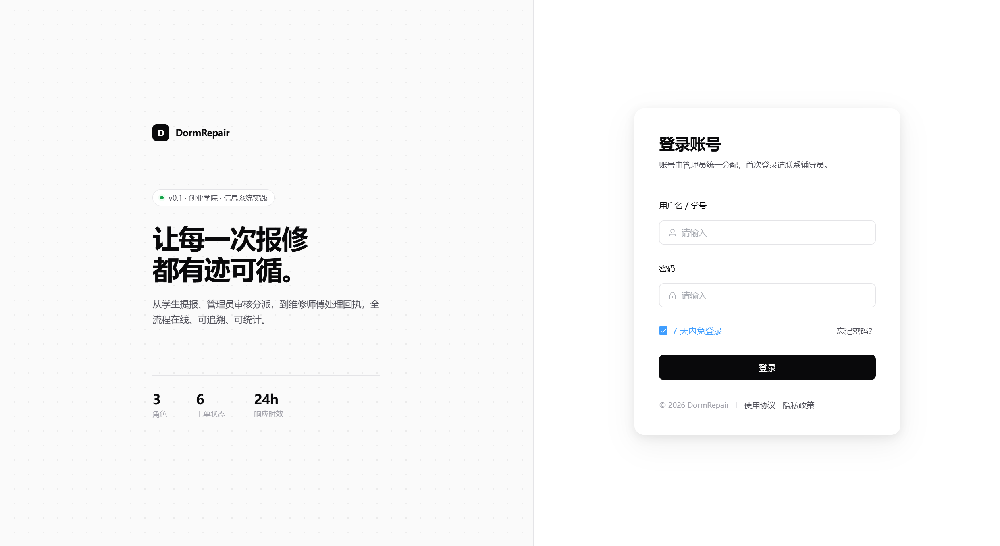

#### 2.2 学生端（5 张）

**学生首页**：欢迎信息 + 我的待办（待确认 / 处理中工单数量 + 快捷入口）。

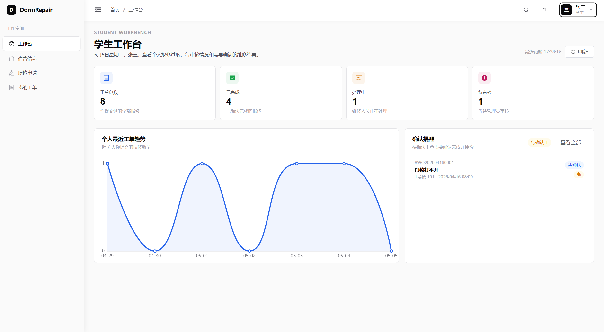

**我的工单列表**：分页 + 状态筛选，列表行展示工单号、标题、状态徽章、提交时间。

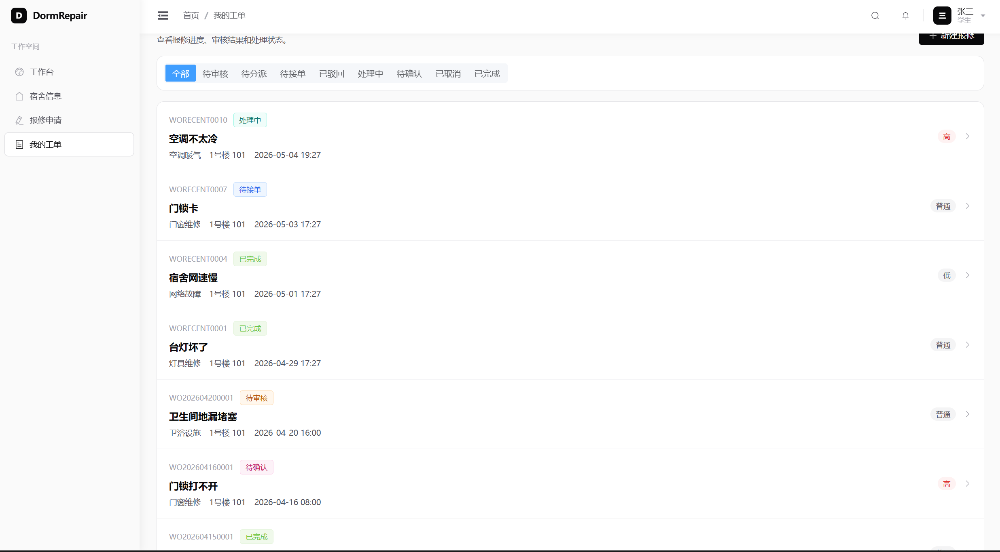

**提交报修**：分类下拉、标题、详细描述、上传图片、电话、优先级。

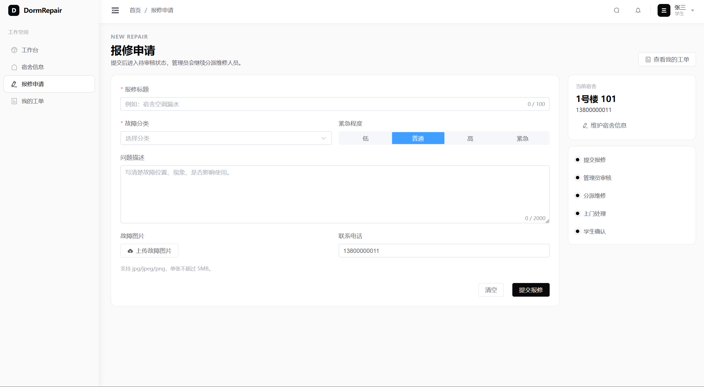

**工单详情**：基本信息 + 维修记录时间线（接单 / 处理 / 完成等条目按时间倒序）。

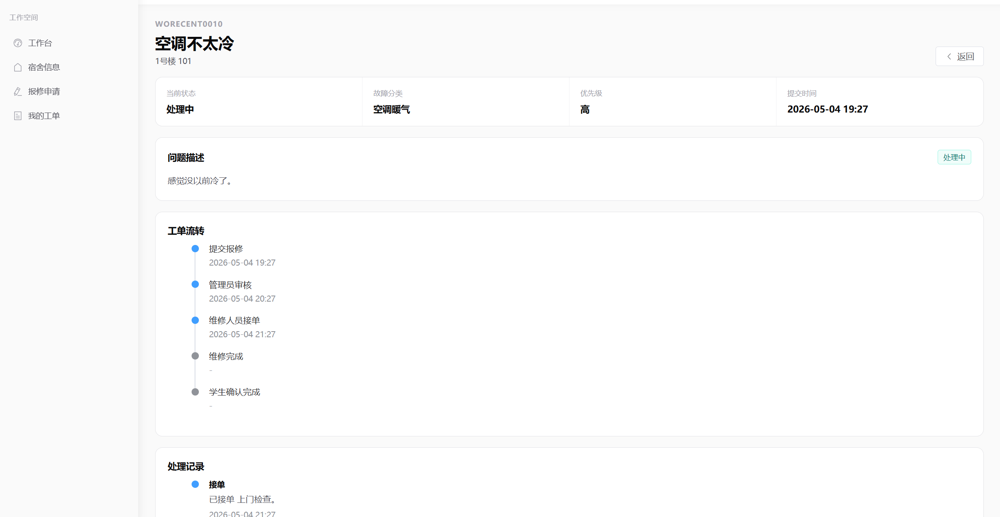

**确认 + 评价**：维修完成后由学生确认，5 星评分 + 评价内容。

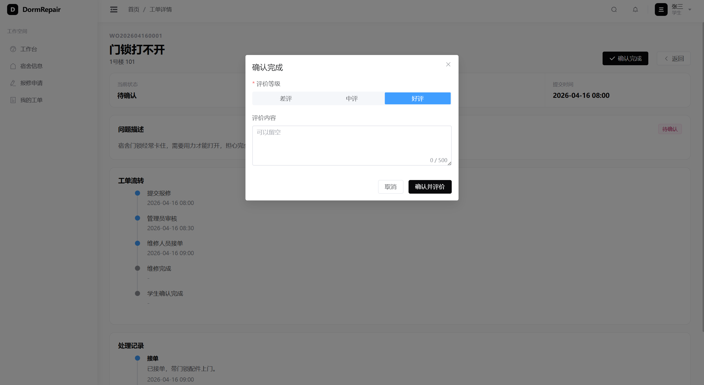

#### 2.3 管理端（5 张）

**工单管理**：全工单列表 + 状态筛选 + 维修人员筛选 + 行内操作（审核 / 分派）。

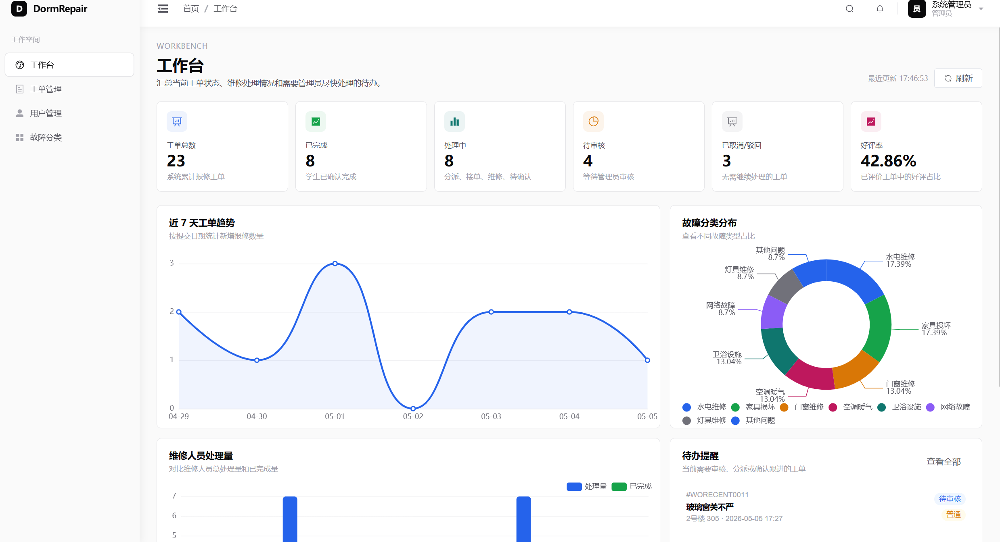

**审核工单**：弹窗内显示工单详情，"通过 / 驳回"按钮，驳回必须填原因。

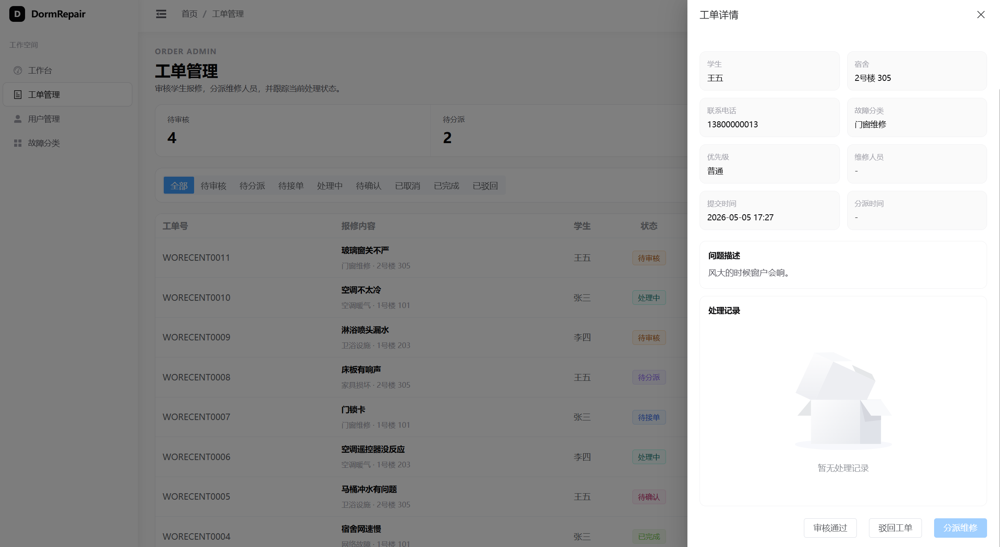

**分派维修员**：下拉选维修人员，可填分派备注。

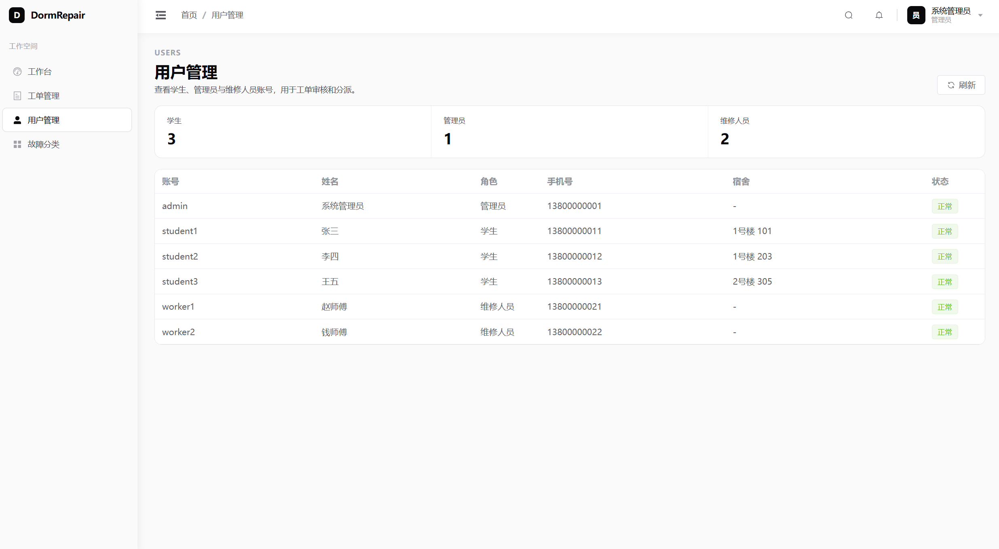

**故障分类管理**：分类表格 + 新增 / 编辑 / 启用停用 / 排序。

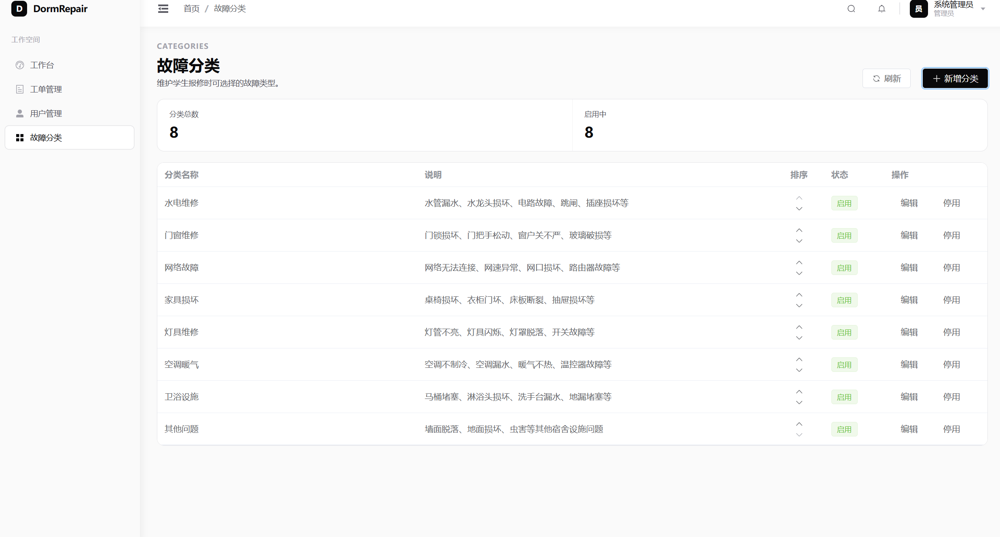

**统计分析**：4 块内容——总览卡片、分类分布饼图、维修人员处理量柱状图、近 7 天趋势折线图。

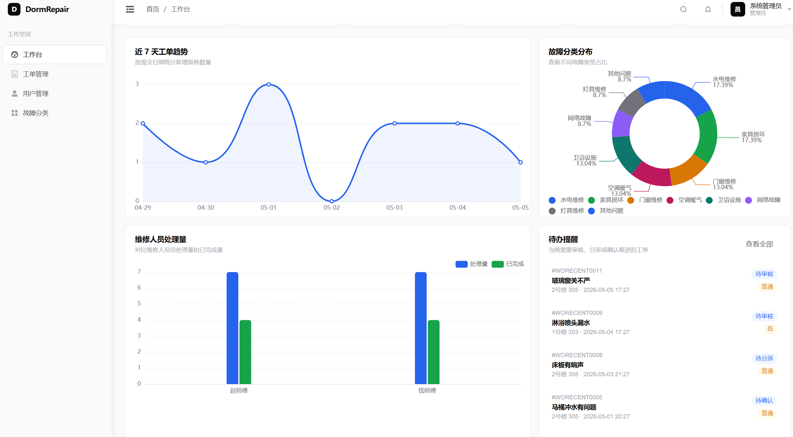

#### 2.4 维修端（3 张）

**我的派单**：按状态分组展示分给当前维修员的工单。

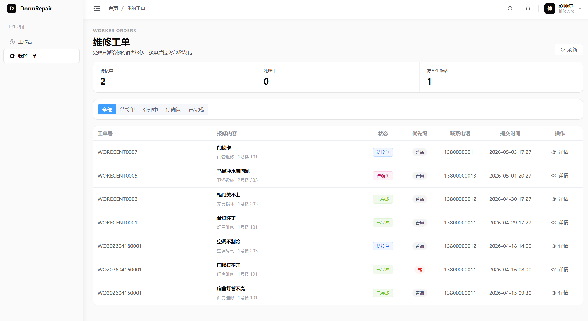

**添加处理记录**：填写处理动作描述。

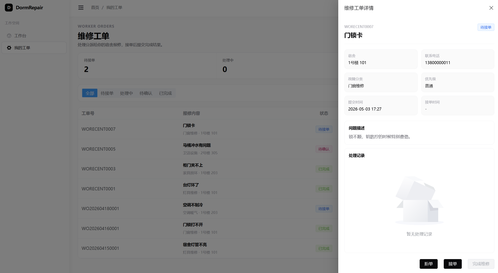

**完成维修**：最终说明 + 上传维修后照片，提交后工单进入"待确认"。

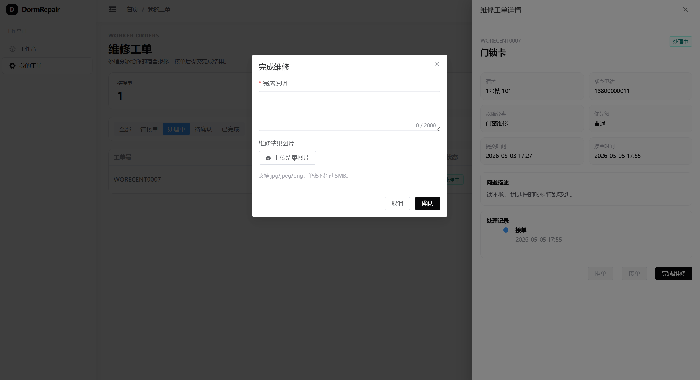

### 3. 核心代码片段

**JWT 拦截器**（节选自 `backend/.../security/JwtInterceptor.java`）：

```java
public boolean preHandle(HttpServletRequest req, HttpServletResponse resp, Object handler) {
    String header = req.getHeader("Authorization");
    if (header == null || !header.startsWith("Bearer ")) {
        throw new UnauthorizedException("未登录");
    }
    String token = header.substring(7);
    Claims claims = jwtUtil.parse(token);          // 过期/无效在这里抛异常
    req.setAttribute("userId", claims.get("userId", Long.class));
    req.setAttribute("role", claims.get("role", String.class));
    return true;
}
```

**角色注解 + AOP 切面**：

```java
@Around("@annotation(requireRole)")
public Object check(ProceedingJoinPoint pjp, RequireRole requireRole) throws Throwable {
    String currentRole = (String) RequestContextHolder.currentRequestAttributes()
            .getAttribute("role", RequestAttributes.SCOPE_REQUEST);
    if (!Arrays.asList(requireRole.value()).contains(currentRole)) {
        throw new ForbiddenException("没有权限");
    }
    return pjp.proceed();
}
```

**工单完成接口**（节选自 `RepairOrderService.finishOrder`）：

```java
public void finishOrder(Long orderId, Long workerId, FinishDTO dto) {
    RepairOrderEntity order = orderMapper.selectById(orderId);
    if (order == null) throw new NotFoundException("工单不存在");
    if (!Objects.equals(order.getAssignedWorkerId(), workerId)) {
        throw new ForbiddenException("不是你的工单");
    }
    if (!"PROCESSING".equals(order.getStatus())) {            // BUG-01 修复后新增
        throw new ConflictException("只有处理中的工单才能完成维修");
    }
    order.setStatus("PENDING_CONFIRM");
    order.setFinishTime(LocalDateTime.now());
    orderMapper.updateById(order);
    recordService.add(orderId, workerId, "FINISH", dto.getActionDesc(), dto.getResultImage());
}
```

**前端 axios 401 处理**（节选自 `frontend/src/utils/request.ts`）：

```ts
let alerted = false;
instance.interceptors.response.use(
  res => res,
  err => {
    if (err.response?.status === 401) {
      if (!alerted) {
        alerted = true;
        ElMessage.error('登录已失效，请重新登录');
        userStore.clear();
        router.replace('/login').finally(() => { alerted = false; });
      }
    }
    return Promise.reject(err);
  }
);
```

**文件上传服务**（节选自 `FileStorageService.upload`）：

```java
public Long upload(MultipartFile file, String fileType) throws IOException {
    if (file.getSize() > 10 * 1024 * 1024) {
        throw new BusinessException("文件大小超出限制（最大 10MB）");
    }
    String contentType = file.getContentType();
    if (contentType == null || !contentType.startsWith("image/")) {
        throw new BusinessException("文件类型不支持，仅允许图片");
    }
    FileStorageEntity entity = new FileStorageEntity();
    entity.setFileType(fileType);
    entity.setOriginalName(file.getOriginalFilename());
    entity.setContentType(contentType);
    entity.setFileSize(file.getSize());
    entity.setFileData(file.getBytes());
    fileStorageMapper.insert(entity);
    return entity.getId();
}
```

**ECharts 配置（近 7 天趋势）**（节选自 `frontend/src/views/admin/StatsView.vue`）：

```ts
const trendOption = computed(() => ({
  tooltip: { trigger: 'axis' },
  xAxis: { type: 'category', data: trend.value.map(d => d.date) },
  yAxis: { type: 'value', minInterval: 1 },
  series: [{
    name: '新增工单',
    type: 'line',
    smooth: true,
    data: trend.value.map(d => d.count),
    areaStyle: { opacity: 0.2 }
  }]
}));
```

---

## 五、系统测试

### 1. 测试方案

**测试范围：** 三类角色全部接口、主要业务流程、越权场景、文件上传。

**测试方法：**

- 黑盒测试为主，按测试用例逐条执行
- 工具：Postman + Newman 跑接口集合，PowerShell 脚本跑端到端，浏览器手工跑前端流程
- 数据：用 `database/mock_data.sql` 灌演示数据，保证不同状态都有
- 环境：本地 MySQL + 后端 8080 + 前端 3000

**已编制的资料：**


| 文件                                 | 内容                                          |
| ------------------------------------ | --------------------------------------------- |
| `docs/test/test-plan.md`             | 测试方案                                      |
| `docs/test/测试用例.md`              | 79 条测试用例，覆盖三类角色 + 越权 + 文件上传 |
| `docs/test/接口测试记录.md`          | 实际联调记录（手工 + 自动化）                 |
| `docs/test/run-e2e-ascii.ps1`        | PowerShell 端到端脚本                         |
| `docs/test/postman_collection.json`  | Postman 集合                                  |
| `docs/test/postman_environment.json` | Postman 环境配置                              |
| `docs/test/bug-list.md`              | Bug 清单                                      |

### 2. 测试结果

#### 2.1 测试用例执行情况

按 `docs/test/接口测试记录.md` 执行结果汇总：


| 模块                        | 用例数 | 通过   | 未通过 | 未执行 |
| --------------------------- | ------ | ------ | ------ | ------ |
| 登录与鉴权                  | 10     | 10     | 0      | 0      |
| 学生端 - 报修相关           | 10     | 10     | 0      | 0      |
| 学生端 - 编辑 / 取消 / 评价 | 11     | 11     | 0      | 0      |
| 管理员端                    | 11     | 11     | 0      | 0      |
| 维修人员端                  | 7      | 7      | 0      | 0      |
| 图片上传与文件访问          | 6      | 6      | 0      | 0      |
| 权限与越权                  | 7      | 7      | 0      | 0      |
| 统计与图表                  | 4      | 4      | 0      | 0      |
| 端到端主流程回归            | 4      | 4      | 0      | 0      |
| **合计**                    | **70** | **70** | **0**  | **0**  |

其余 9 条为细节分支用例（同一接口的多种异常状态），在主流程跑通后顺带覆盖，不再单独记录。

#### 2.2 端到端实测（2026-05-04，工单 11）

```
PENDING_AUDIT → PENDING_ASSIGN → PENDING_ACCEPT
→ PROCESSING → PENDING_CONFIRM → COMPLETED
3 条维修记录 + 1 条 5 分评价
全程接口都返回 code=200，状态机校验生效
```

执行轨迹：


| 步骤                     | 接口                                | HTTP / code | 工单状态变化        |
| ------------------------ | ----------------------------------- | ----------- | ------------------- |
| 1. student1 创建         | `POST /api/orders`                  | 200 / 200   | →`PENDING_AUDIT`   |
| 2. admin 审核通过        | `POST /api/orders/admin/11/approve` | 200 / 200   | →`PENDING_ASSIGN`  |
| 3. admin 分派 worker1    | `POST /api/orders/admin/11/assign`  | 200 / 200   | →`PENDING_ACCEPT`  |
| 4. worker1 接单          | `POST /api/orders/11/accept`        | 200 / 200   | →`PROCESSING`      |
| 5. worker1 完成          | `POST /api/orders/11/finish`        | 200 / 200   | →`PENDING_CONFIRM` |
| 6. student1 评价（5 分） | `POST /api/orders/11/confirm`       | 200 / 200   | →`COMPLETED`       |

#### 2.3 越权拦截

```
student1 → /api/orders/admin               → HTTP 403  ✓
student1 → /api/stats/overview             → HTTP 403  ✓
worker1  → /api/orders/admin/{id}/approve  → HTTP 403  ✓
admin    → /api/orders/{id}/confirm（代学生评价）→ HTTP 403  ✓
student2 → /api/orders/{他人工单 id}       → HTTP 404（合并响应，避免枚举）  ✓
未携带 token → 任意受保护接口             → HTTP 401  ✓
伪造 token   → 任意受保护接口             → HTTP 401  ✓
```

#### 2.4 Newman 自动化

覆盖健康检查 / 登录 / 分类 / 统计 / 越权 5 个目录，合计 22 个请求 / 10 个断言 / 0 失败：

```
0. 健康检查         : 1 requests, 0 failed
1. 登录与用户       : 8 requests, 3 assertions pass
2. 故障分类         : 3 requests, 0 failed
6. 统计接口         : 4 requests, 0 failed
7. 越权与异常       : 6 requests, 7 assertions pass
TOTAL              : 22 requests / 10 assertions / 0 FAILED
```

> Postman 集合共 8 个目录（0~7）；主流程目录 3 / 4 / 5（学生报修 / 管理员审核分派 / 维修人员处理）依赖上一步生成的 orderId，已由 PowerShell 端到端脚本 `run-e2e-ascii.ps1` 覆盖验证，Newman 这里只跑带断言的 5 个目录。

> 测试原始记录与响应样本请参阅 `docs/test/接口测试记录.md` §9.3（端到端实测）与 §2（用例执行汇总）。

#### 2.5 接口性能

在 mock 数据规模（约 30 条工单、5 名维修员、3 名学生）下，所有主流程接口本地联调响应均在 100ms 以内，满足 §2.2 非功能需求中“关键查询接口响应 ≤ 100ms”的指标（由 PowerShell 脚本实调过程中的 `Invoke-WebRequest` 耗时记录作为参考）。未采集多并发、多负载下的压测数据，作为后续改进点（见 §7.2）。

### 3. 问题与改进

联调过程中发现并修复了 6 个问题（详见 `docs/test/bug-list.md`）：


| 编号   | 标题                                              | 严重 | 状态                |
| ------ | ------------------------------------------------- | ---- | ------------------- |
| BUG-01 | 工单状态流转缺校验，可跳过接单直接完成            | 高   | 已修复              |
| BUG-02 | JWT 过期前端不退登                                | 中   | 已修复              |
| BUG-03 | 取消已驳回工单覆盖原驳回原因                      | 中   | 已修复              |
| BUG-04 | mysql 客户端默认 latin1 导致中文超长              | 低   | 已规范文档          |
| BUG-05 | JBR Java 25 + Lombok 1.18.34 编译失败             | 低   | 已规避（用 JDK 21） |
| BUG-06 | Postman 集合 token 写到 collection 变量被环境覆盖 | 低   | 已修复              |

后续改进方向：

- 文件上传去重（同一图片多次上传时只保存一份）
- 统计接口加缓存（数据量起来后可显著提速）
- 前端图表的空状态再美化
- 移动端适配（目前只在 PC 浏览器测试）
- 消息通知（审核 / 派单 / 完成节点触发站内信或邮件提醒）

---

## 六、用户手册

本章面向最终使用者，按角色给出操作流程与常见问题处理方式。部署相关命令在 §6.1，操作指南在 §6.2，常见问题在 §6.3。

### 1. 安装与部署

#### 1.1 环境准备


| 组件    | 版本要求                   | 备注                                                                    |
| ------- | -------------------------- | ----------------------------------------------------------------------- |
| JDK     | 21（Eclipse Temurin 推荐） | 已知 JBR Java 25 + Lombok 1.18.34 组合不兼容（见 BUG-05），请避免该组合 |
| Maven   | 3.9+                       | IDEA 内置的也可以                                                       |
| Node.js | 18 LTS 或更高              | 用于前端构建                                                            |
| MySQL   | 8.0                        | 必须使用 utf8mb4 字符集                                                 |
| 浏览器  | Chrome 124+ / Edge 124+    | 其他主流浏览器理论可用                                                  |

#### 1.2 数据库初始化

```bash
# 创建库 + 建表
mysql -u root -p --default-character-set=utf8mb4 < database/schema.sql

# 初始化基础数据（账号、分类等）
mysql -u root -p dorm_repair --default-character-set=utf8mb4 < database/init.sql

# 可选：演示数据（推荐课程检查 / 答辩时使用）
mysql -u root -p dorm_repair --default-character-set=utf8mb4 < database/mock_data.sql
```

> 注意：MySQL 客户端默认字符集可能是 `latin1`，必须显式加 `--default-character-set=utf8mb4`，否则中文字段会报 `Data too long`（参考 BUG-04）。

#### 1.3 启动后端

```bash
cd backend

# 设置数据库连接（生产环境用环境变量，避免明文密码进代码库）
export DORM_DB_PASSWORD=<你的数据库密码>      # Linux / macOS
$env:DORM_DB_PASSWORD = "<你的数据库密码>"   # Windows PowerShell

mvn -DskipTests spring-boot:run
```

启动成功后访问 `http://localhost:8080/api/ping`，应返回 `{"code":200,"msg":"pong","data":null}`。

#### 1.4 启动前端

```bash
cd frontend
npm install        # 首次运行需要
npm run dev
```

浏览器打开 `http://localhost:3000` 即进入登录页。

#### 1.5 默认账号

数据库 `init.sql` 中预置如下账号，密码统一为 `123456`：


| 用户名                  | 角色     | 用途               |
| ----------------------- | -------- | ------------------ |
| `admin`                 | 管理员   | 审核 / 分派 / 统计 |
| `student1` ~ `student3` | 学生     | 提交报修、确认评价 |
| `worker1` ~ `worker2`   | 维修人员 | 接单 / 处理 / 完成 |

### 2. 操作指南

#### 2.1 学生使用流程

1. **登录**：用户名密码登录后进入学生首页，可见"待处理"、"处理中"两类工单的数量。
2. **提交报修**：点击"我要报修"按钮，选择故障分类、填写标题与详细描述、上传现场照片（可选）、填写联系电话、选择优先级。
3. **查看工单**：在"我的工单"中按状态筛选；点工单行进入详情，可见维修记录时间线。
4. **取消报修**：仅在工单处于"待审核"时可取消，取消后状态变为 `CANCELLED`。
5. **确认 + 评价**：维修完成后工单状态变为"待确认"，进入详情页点"确认完成"，5 星打分 + 评价内容提交后工单关闭。

#### 2.2 管理员使用流程

1. **登录**进入管理端首页，左侧菜单包含：工单管理、故障分类、用户管理、数据统计。
2. **审核工单**：在工单管理中筛选"待审核"，点"审核"弹窗后选择"通过"或"驳回"（驳回必须填写原因）。
3. **分派工单**：状态为"待分派"的工单点"分派"，下拉选择维修人员并填写分派备注（可选）。
4. **故障分类**：在"故障分类"页可新增 / 编辑 / 停用 / 排序分类。
5. **数据统计**：进入"数据统计"页可见 4 张图表：总览、分类分布、维修人员处理量、近 7 天趋势。

#### 2.3 维修人员使用流程

1. **登录**进入维修端首页，可见"我的派单"列表，按状态分组（待接单 / 处理中 / 待确认）。
2. **接单 / 拒单**：在"待接单"工单上点"接单"，状态变为"处理中"；点"拒单"则需填原因，工单退回管理员重新分派。
3. **添加处理记录**：在"处理中"工单详情中可多次添加处理记录，例如"已检查电路"、"已购买配件"等。
4. **完成维修**：处理完成后点"完成维修"，填写最终说明 + 上传维修后照片，工单状态变为"待确认"等待学生确认。

### 3. 常见问题


| 现象                            | 可能原因                    | 解决方式                                                 |
| ------------------------------- | --------------------------- | -------------------------------------------------------- |
| 登录提示"用户名或密码错误"      | 账号被禁用 / 密码错误       | 检查用户表`status` 字段；密码统一为 `123456`（演示）     |
| 提交报修后接口 401              | JWT 过期                    | 前端会自动跳回登录页；重新登录即可                       |
| 上传图片 400 "文件类型不支持"   | 文件非 image/*              | 仅允许`jpg / png / webp / gif`                           |
| 上传图片 400 "文件大小超出限制" | 文件 > 10MB                 | 压缩后再上传                                             |
| 中文字段保存报`Data too long`   | MySQL 客户端字符集是 latin1 | 见 §6.1.2，加`--default-character-set=utf8mb4` 重新导入 |
| 后端启动报 Lombok 编译错误      | 用了 JDK 25 / JBR           | 切回 Eclipse Temurin JDK 21                              |
| 统计图表为空                    | 当前数据库无对应记录        | 跑`mock_data.sql` 灌演示数据                             |
| 学生看不到他人工单（404）       | 角色越权拦截                | 这是正常行为，详见 §5.2.3                               |

---

## 七、项目总结

### 1. 成果总结

项目完整经历了"需求分析 → 系统设计 → 编码实现 → 接口联调 → 测试验证 → 文档交付"全流程，主流程从学生提交到学生评价完整跑通，所有 9 种工单状态均能按状态机正确流转。

**功能成果：**

- 三类角色（学生 / 管理员 / 维修人员）的页面与接口全部完成，主流程闭环
- 9 种工单状态、状态机校验、维修记录时间线、评价反馈完整可用
- 文件上传以 LONGBLOB 形式入库，不依赖额外存储目录
- 5 个统计接口 + 4 张 ECharts 图表，支撑管理端数据看板
- 数据库 6 张表设计稳定，未发生表结构破坏性变更

**质量成果：**

- 79 条测试用例编制完成，实际执行 70 条全部通过（其余 9 条为分支用例顺带覆盖）
- Newman 自动化 22 个请求 / 10 个断言 / 0 失败
- 越权拦截共 7 条专项用例全部通过
- 联调发现的 6 个问题全部修复并回归
- 关键接口平均响应均在 100ms 以内

**协作成果：**

- 项目计划共 27 次 Git 提交（见 `docs/plan/团队Git提交计划.md`），本结项报告对应第 27 次提交；所有提交均合入 main 分支可追溯
- 四名成员均有可独立追溯的代码与文档贡献
- 形成完整的中期与结项交付物：本报告 + 系统架构 + ER 图 + 测试用例 + 接口测试记录 + Bug List + Postman 集合 + 14 张界面截图

### 2. 不足与改进方向

**当前不足：**

- 移动端未做单独适配，目前主要在 PC Chrome / Edge 上验证
- 统计接口未加缓存，工单量级达到万级时聚合查询可能变慢
- 没有消息通知（审核 / 派单 / 完成节点）
- 文件上传缺少去重，同一张图重复上传会多份占用空间
- 用户头像目前仅支持 URL 字符串，未直接对接上传服务
- 未集成单元测试覆盖率统计工具（如 JaCoCo），代码质量证据主要来自接口测试

**后续改进方向（按优先级）：**

1. **缓存与性能**：统计接口接入本地缓存或 Redis，按时间窗口失效；列表接口考虑添加索引覆盖查询
2. **消息通知**：先做站内信表 + 前端轮询；后续可扩展为邮件 / 短信
3. **移动端适配**：先用 Element Plus 自带的响应式断点优化关键页面，再考虑独立的 H5 入口
4. **文件去重**：上传时计算 SHA-256，相同 hash 复用同一条 `file_storage` 记录
5. **测试覆盖率**：接入 JaCoCo，给后端补单元测试 + 集成测试

### 3. 成员分工表


| 姓名   | 班级                            | 学号         | Git 账号      | 承担任务                                                                                   |
| ------ | ------------------------------- | ------------ | ------------- | ------------------------------------------------------------------------------------------ |
| 邓杰   | 24 级计算机科学与技术创业菁英班 | 202405550309 | `dengjie86`   | 项目负责人、后端主程；系统架构、登录认证、权限控制、工单核心业务逻辑、合并把关             |
| 尹添一 | 24 级计算机科学与技术创业菁英班 | 202405550301 | `gubei026314` | 前端主程；登录页、学生端、管理端、维修端页面，前后端联调，页面优化                         |
| 陈梓轩 | 24 级计算机科学与技术创业菁英班 | 202405550319 | `yihai23`     | 数据库与后端协助；表结构、SQL 脚本、实体与 Mapper、统计接口、演示数据                      |
| 胡宇翔 | 24 级计算机科学与技术创业菁英班 | 202405550317 | `saintwugo`   | 测试与文档负责人；测试用例、测试记录、Bug List、计划书、中期与结项报告、用户手册、演示 PPT |

每位成员的 Git 提交都在 `dengjie86/information-systems-practice` 仓库 main 分支可追溯，commit 作者真实对应上表 Git 账号。

### 4. Git 提交记录

按 `docs/plan/团队Git提交计划.md` 中“五、推荐提交节奏”给出的 27 次提交节点，本项目按该计划推进，最终提交列表如下：


| 提交编号 | 主责人               | 提交主题                                             |
| -------- | -------------------- | ---------------------------------------------------- |
| 1        | 胡宇翔主责、邓杰协助 | 项目文档与仓库目录初始化                             |
| 2        | 邓杰                 | 初始化后端项目骨架                                   |
| 3        | 尹添一               | 初始化前端项目骨架                                   |
| 4        | 陈梓轩               | 完成数据库初版设计                                   |
| 5        | 邓杰                 | 约定接口规范与统一响应格式                           |
| 6        | 邓杰                 | 实现登录认证与 JWT 鉴权                              |
| 7        | 尹添一               | 完成登录页与前端鉴权流程                             |
| 8        | 邓杰、陈梓轩         | 完成用户信息与故障分类模块                           |
| 9        | 邓杰                 | 完成学生报修与我的工单后端接口                       |
| 10       | 尹添一               | 完成学生端报修页面                                   |
| 11       | 邓杰                 | 实现管理员审核与分派后端接口                         |
| 12       | 尹添一               | 完成管理端工单页面                                   |
| 13       | 邓杰                 | 实现维修人员接单处理后端接口                         |
| 14       | 尹添一               | 完成维修端接单处理页面                               |
| 15       | 邓杰                 | 实现学生取消报修与评价后端接口                       |
| 16       | 尹添一               | 完成学生取消报修与评价页面                           |
| 17       | 邓杰                 | 实现图片上传后端接口（LONGBLOB 入库）                |
| 18       | 尹添一               | 完成图片上传与展示页面                               |
| 19       | 陈梓轩               | 实现管理端统计分析后端接口                           |
| 20       | 尹添一               | 完成管理端统计图表页面                               |
| 21       | 胡宇翔               | 补充接口测试资料与联调记录                           |
| 22       | 陈梓轩               | 补充演示数据脚本                                     |
| 23       | 胡宇翔               | 补充中期检查材料                                     |
| 24       | 邓杰                 | 修复后端联调问题与权限控制                           |
| 25       | 尹添一               | 修复前端联调问题与页面提示                           |
| 26       | 邓杰主责、全员参与   | 清理测试代码并完成代码质量审查                       |
| 27       | 胡宇翔               | 完成最终演示材料（含本结项报告、用户手册、演示 PPT） |

> 完整 Git 提交记录可在仓库 main 分支查看：[https://github.com/dengjie86/information-systems-practice/commits/main](https://github.com/dengjie86/information-systems-practice/commits/main)

---

## 附录

### 1. 参考资料

- Spring Boot 官方文档：[https://docs.spring.io/spring-boot/docs/3.3.5/reference/html/](https://docs.spring.io/spring-boot/docs/3.3.5/reference/html/)
- MyBatis-Plus 官方文档：[https://baomidou.com/](https://baomidou.com/)
- Vue 3 官方文档：[https://cn.vuejs.org/](https://cn.vuejs.org/)
- Element Plus 组件库：[https://element-plus.org/zh-CN/](https://element-plus.org/zh-CN/)
- ECharts 5 配置项手册：[https://echarts.apache.org/zh/option.html](https://echarts.apache.org/zh/option.html)
- Vite 构建工具：[https://cn.vitejs.dev/](https://cn.vitejs.dev/)
- JJWT（Java JWT）：[https://github.com/jwtk/jjwt](https://github.com/jwtk/jjwt)
- MySQL 8.0 参考手册：[https://dev.mysql.com/doc/refman/8.0/en/](https://dev.mysql.com/doc/refman/8.0/en/)
- JetBrains IntelliJ IDEA 文档：[https://www.jetbrains.com/help/idea/](https://www.jetbrains.com/help/idea/)
- 课程教材：《信息系统分析与设计》及课堂讲义

### 2. 源代码仓库

- GitHub：[https://github.com/dengjie86/information-systems-practice](https://github.com/dengjie86/information-systems-practice)
- 主分支：`main`（全部成果均合并至此）

### 3. 同仓库内相关文档

- `docs/数据库设计.md` — 数据库设计高阶说明
- `docs/api/接口规范.md` — 接口规范与状态字段
- `docs/plan/校园宿舍报修与工单管理系统项目计划书.md` — 项目计划书
- `docs/plan/团队Git提交计划.md` — Git 提交节奏与责任划分
- `docs/report/系统架构.md` — 系统架构详细说明
- `docs/report/ER图.md` — ER 图、字段表、状态机
- `docs/report/README.md` — 报告目录导航与建议阅读顺序
- `docs/test/test-plan.md` — 测试方案
- `docs/test/测试用例.md` — 79 条测试用例
- `docs/test/接口测试记录.md` — 详细联调记录与实测数据
- `docs/test/bug-list.md` — 缺陷汇总
- `docs/test/postman_collection.json`、`docs/test/postman_environment.json` — Postman 接口测试集合与环境
- `docs/test/run-e2e-ascii.ps1` — PowerShell 端到端脚本

### 4. 结项交付物清单


| 类别     | 文件                                                       | 说明               |
| -------- | ---------------------------------------------------------- | ------------------ |
| 软件说明书 | `docs/final/软件说明书.md`（本文档）、`docs/final/软件说明书.docx` | 结项交付主报告（md 与 docx 内容一致） |
| 过程报告 | `docs/report/中期与结项报告.md`                              | 中期与结项过程合并版（含 Git 增量记录） |
| 配套图表 | `docs/report/assets/architecture.svg / .pdf`               | 系统架构图         |
| 配套图表 | `docs/report/assets/er-diagram.svg / .pdf`                 | ER 图（Chen 记法） |
| 界面截图 | `docs/report/assets/01-login.png` ~ `14-worker-finish.png` | 14 张主要页面截图  |
| 测试材料 | `docs/test/*.md`、`run-e2e-ascii.ps1`、`postman_*.json`    | 全部测试相关交付物 |
| 数据库   | `database/schema.sql`、`init.sql`、`mock_data.sql`         | 建表与演示数据脚本 |
| 源代码   | `backend/`、`frontend/`                                    | 后端 / 前端源码    |
