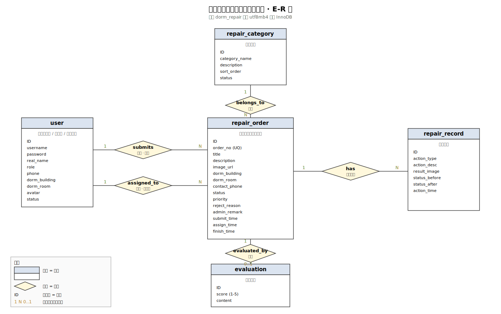

# 数据库 ER 图

数据库的详细字段说明在 `docs/数据库设计.md` 里，这里只画关系图和列出主要字段，方便课程检查时快速看懂表之间是怎么连的。

库名：`dorm_repair`，引擎 InnoDB，编码 utf8mb4。

## 正式 ER 图（Chen 记法）

正式版 E-R 图（矩形实体 + 菱形联系 + 主键下划线 + 1 / 0..* 基数）放在同目录 `assets/`：

- `assets/er-diagram.pdf` — 课程检查使用，A4 横向
- `assets/er-diagram.svg` — 矢量源文件，可缩放、可在浏览器/IDE 中预览
- `assets/er-diagram.html` — 打印壳，浏览器打开 → Ctrl+P 即可重新导出 PDF



下面的 ASCII 版本是供 Markdown 直接阅读的简化形式，内容与上图一致。

## 一、ER 关系图

```
                 ┌──────────────────────────┐
                 │           user           │
                 │  id (PK)                 │
                 │  username (UQ)           │
                 │  password                │
                 │  real_name               │
                 │  role  STUDENT/ADMIN/    │
                 │        WORKER            │
                 │  phone                   │
                 │  dorm_building           │
                 │  dorm_room               │
                 │  avatar                  │
                 │  status                  │
                 └─────────┬───────┬────────┘
                           │       │
              报修人 user_id│       │被分派人 assigned_worker_id
                           │       │
                           ▼       ▼
                 ┌──────────────────────────┐
                 │       repair_order       │
   分类 1───────►│  id (PK)                 │
   category_id  │  order_no (UQ)           │
                 │  user_id (FK→user)       │
                 │  category_id (FK)        │
                 │  title                   │
                 │  description             │
                 │  image_url               │
                 │  dorm_building/room      │
                 │  contact_phone           │
                 │  status   9 种状态         │
                 │  priority LOW/NORMAL/    │
                 │           HIGH/URGENT    │
                 │  assigned_worker_id (FK) │
                 │  reject_reason           │
                 │  admin_remark            │
                 │  dispatch_remark         │
                 │  submit/assign/accept/   │
                 │  finish/close_time       │
                 └────┬───────────┬─────────┘
                      │           │
                      │ 1         │ 1
                      │           │
                      ▼ 0..*       ▼ 0..1
            ┌──────────────────┐  ┌────────────────────┐
            │  repair_record   │  │     evaluation     │
            │  id (PK)         │  │  id (PK)           │
            │  order_id (FK)   │  │  order_id (FK, UQ) │
            │  worker_id (FK)  │  │  user_id (FK)      │
            │  action_desc     │  │  score 1-5         │
            │  action_type     │  │  content           │
            │  ACCEPT/REJECT/  │  │  create_time       │
            │  START/FINISH    │  └────────────────────┘
            │  result_image    │
            │  status_before   │
            │  status_after    │
            │  action_time     │
            └──────────────────┘

            ┌──────────────────────────┐
            │     repair_category      │
            │  id (PK)                 │
            │  category_name           │
            │  description             │
            │  sort_order              │
            │  status                  │
            └──────────────────────────┘
                       ▲
                       │ 1
                       │
                       │ 0..*
                       │
                  repair_order.category_id
```

## 二、关系一览

| 关系 | 类型 | 约束 | 说明 |
| --- | --- | --- | --- |
| user → repair_order（报修人） | 1 : 0..* | 强关联（FK） | 一个学生能交多个工单 |
| user → repair_order（维修人员） | 1 : 0..* | 强关联（FK） | 一个维修师傅能接多个工单 |
| repair_category → repair_order | 1 : 0..* | 强关联（FK） | 一个分类下有很多工单 |
| repair_order → repair_record | 1 : 0..* | 强关联（FK） | 一个工单可以有多条处理记录 |
| repair_order → evaluation | 1 : 0..1 | 强关联（FK） | 一个工单最多一条评价（order_id 唯一索引） |
| user → repair_record（操作人） | 1 : 0..* | 强关联（FK） | 维修人员的所有操作记录 |
| repair_order.image_url → file_storage | 0..* : 0..* | **弱关联** | image_url 存 `/api/files/{id}` 字符串，多张逗号分隔，无 FK 约束 |
| repair_record.result_image → file_storage | 0..* : 0..* | **弱关联** | 同上，仅 FINISH 记录才有 |

## 三、各表字段（精简）

完整字段定义看 `database/schema.sql`，这里只列每个表的主要字段。

### 3.1 user

| 字段 | 类型 | 说明 |
| --- | --- | --- |
| id | BIGINT PK | 主键 |
| username | VARCHAR(50) UQ | 登录名 |
| password | VARCHAR(255) | BCrypt 哈希 |
| real_name | VARCHAR(50) | 姓名 |
| role | VARCHAR(20) | STUDENT / ADMIN / WORKER |
| phone | VARCHAR(20) | 手机号 |
| dorm_building / dorm_room | VARCHAR | 学生填，其他角色可空 |
| avatar | VARCHAR(255) | 头像 url |
| status | TINYINT | 1 正常 / 0 禁用 |

### 3.2 repair_category

| 字段 | 类型 | 说明 |
| --- | --- | --- |
| id | BIGINT PK | |
| category_name | VARCHAR(50) | 分类名 |
| description | VARCHAR(255) | 描述 |
| sort_order | INT | 前端列表用 |
| status | TINYINT | 1 启用 / 0 停用 |

### 3.3 repair_order（核心表）

| 字段 | 类型 | 说明 |
| --- | --- | --- |
| id | BIGINT PK | |
| order_no | VARCHAR(32) UQ | 工单号，格式 WO + yyyyMMdd + 序号 |
| user_id | BIGINT FK | 报修学生 |
| title | VARCHAR(100) | 标题 |
| category_id | BIGINT FK | 故障分类 |
| description | TEXT | 详细描述 |
| image_url | VARCHAR(500) | 图片，多张逗号分隔 |
| dorm_building / dorm_room | VARCHAR | 报修地点 |
| contact_phone | VARCHAR(20) | 联系电话 |
| status | VARCHAR(20) | 9 种状态见下 |
| priority | VARCHAR(10) | LOW / NORMAL / HIGH / URGENT |
| assigned_worker_id | BIGINT FK | 分派给谁 |
| reject_reason | VARCHAR(255) | 驳回原因 |
| admin_remark | VARCHAR(255) | 管理员审核备注 |
| dispatch_remark | VARCHAR(255) | 分派备注 |
| submit_time | DATETIME | 学生提交时间 |
| assign_time | DATETIME | 分派时间 |
| accept_time | DATETIME | 接单时间 |
| finish_time | DATETIME | 完成时间 |
| close_time | DATETIME | 关闭时间 |

### 3.4 repair_record

| 字段 | 类型 | 说明 |
| --- | --- | --- |
| id | BIGINT PK | |
| order_id | BIGINT FK | 哪个工单 |
| worker_id | BIGINT FK | 谁操作的 |
| action_type | VARCHAR(20) | ACCEPT / REJECT / START / FINISH |
| action_desc | TEXT | 操作描述 |
| result_image | VARCHAR(500) | 维修后照片，仅 FINISH 才有 |
| status_before | VARCHAR(20) | 操作前的工单状态 |
| status_after | VARCHAR(20) | 操作后的工单状态 |
| action_time | DATETIME | 时间 |

### 3.5 evaluation

| 字段 | 类型 | 说明 |
| --- | --- | --- |
| id | BIGINT PK | |
| order_id | BIGINT FK UQ | 工单（唯一） |
| user_id | BIGINT FK | 评价人，跟 order 的 user_id 一致 |
| score | TINYINT | 1～5 |
| content | VARCHAR(500) | 评价内容 |
| create_time | DATETIME | |

### 3.6 file_storage

图片上传后以二进制形式存在本表，业务表（`repair_order.image_url`、`repair_record.result_image`）仅以字符串 URL（`/api/files/{id}`）引用，**不建外键**。

| 字段 | 类型 | 说明 |
| --- | --- | --- |
| id | BIGINT PK | 上传接口返回的 ID，拼到 URL 里 |
| file_type | VARCHAR(20) | 业务类型。如 `order` / `record` / `avatar` |
| original_name | VARCHAR(255) | 原始文件名 |
| content_type | VARCHAR(50) | MIME。如 `image/png`、`image/jpeg` |
| file_size | BIGINT | 字节数 |
| file_data | LONGBLOB | 二进制内容 |
| create_time | DATETIME | 上传时间 |

为什么不建 FK：字符串 URL 中的 ID 是作为访问路径使用的，`image_url` 还可以同时存外部路径（早期本地文件路径）。为了向后兼容，没有加 FK。清理孤儿文件靠定期脚本（后期补）。

## 四、工单状态流转

```
              ┌──────────────┐
              │PENDING_AUDIT │  ← 学生新提交
              └──────┬───────┘
        驳回         │  审核通过           取消
   ┌──────────┐     │     ┌──────────┐  ┌──────────┐
   │REJECTED  │◄────┤     │PENDING_  │  │CANCELLED │
   └──────────┘     │     │ASSIGN    │  └──────────┘
                    ▼     └────┬─────┘
                 (学生重新提交)  │
                                │ 管理员分派
                                ▼
                          ┌──────────┐
                  退单    │PENDING_  │
              ◄───────────│ ACCEPT   │
                          └────┬─────┘
                               │ 维修人员接单
                               ▼
                          ┌──────────┐
                          │PROCESSING│
                          └────┬─────┘
                               │ 完成维修
                               ▼
                          ┌──────────┐
                          │PENDING_  │
                          │ CONFIRM  │
                          └────┬─────┘
                               │ 学生确认 + 评价
                               ▼
                          ┌──────────┐
                          │COMPLETED │
                          └──────────┘
```

`CLOSED` 是特殊状态，管理员可以在任意非 COMPLETED 状态强制关闭。

## 五、索引和外键

主要索引：

- `user.username` 唯一索引（登录用）
- `repair_order.order_no` 唯一索引
- `repair_order` 上 `user_id` / `category_id` / `assigned_worker_id` / `status` / `submit_time` 都建了索引
- `repair_record` 上 `order_id` / `worker_id`
- `evaluation.order_id` 唯一索引（保证一单一评价）
- `file_storage` 上 `file_type` / `create_time` 加了普通索引，方便按业务类型查询与清理

强关联全部设置为 RESTRICT，保证不会产生孤儿数据。日常开发不会去删 user 或 category，需要禁用就改 status。`file_storage` 作为弱关联表不参与 FK 约束，可独立清理。
